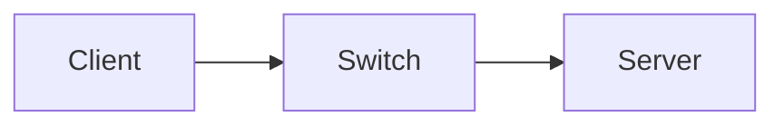

# Lab Report: <TITLE>

## Student

- Name:
- Date:
- Course:
- Lab environment:

## Objective

## Scope

## Prerequisites

## Environment

| Device | Role | OS | IP address | Notes |
|---|---|---|---|---|

## Diagram

## Procedure

1. 
2. 
3. 

## Validation

| Test | Expected | Actual | Result |
|---|---|---|---|

## Problems and resolutions

## Security considerations

## Rollback or recovery

## Reflection

## References
